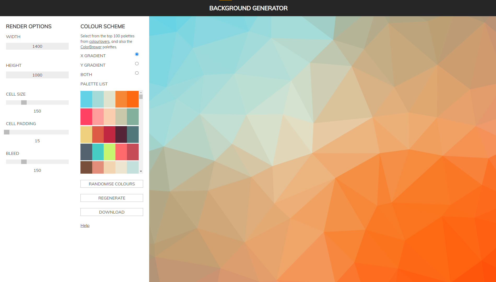

# Background generator

A tool to generate backgrounds from SVGs made with the [Trianglify](https://github.com/qrohlf/trianglify) JS plugin.

The app utilises the [ColourLovers](https://colourlovers.com) API to allow backgrounds to be generated using colours from the top 100
palettes.

See the app in action [here](https://artivain.github.io/background-generator/).

# Générateur de fond d'écran

Un outil pour créer des fond d'écran à partir de SVGs générés par le plugin JS [Trianglify](https://github.com/qrohlf/trianglify).

L'application utilise l'API de [ColourLovers](https://colourlovers.com) pour avoir des palettes de couleurs automatiquement choisies dans le top 100.

Voir le générateur en action [ici](https://artivain.github.io/background-generator/).